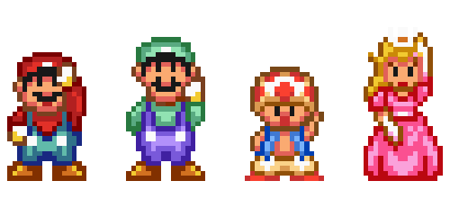
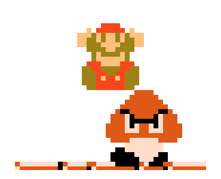

<h1 align="center">
    <br>
    <p align="center">Atividade Semanal 11 - Turma On16 📚 💻<p>
</h1>

<center>


<br/>


</center>


<br/>

Para esta aplicação criamos algumas rotas utilizando os principais métodos HTTP para manipular uma lista de jogos em JSON.

- Utilização do módulo [fs](https://nodejs.dev/learn/the-nodejs-fs-module) para exercitar o novo conteúdo apresentado e melhorar a funcionalidade do servidor criado, pois conseguiremos ver as manipulações de rota alterando direramente nosso mockup Json.

<br/>


## 🏰 Arquitetura MVC


```
📂 para-casa
├── 📁 games
├── 📂img
├── 📂src
│   ├── 📂controllers
|       ├── 📃 gamesController.json
│   ├── 📂models
|       ├── 📃 games.json
│   ├── 📂router
│       ├── 📃 gamesRoutes.js
|   ├── 📃 app.js
├── 📃 .gitignore
├── 📃 package-lock.json
├── 📃 package.json
├── 📃 server.js
```
<br/>

## 🍄 Organização das rotas

Configuração das rotas para manipular a lista de games:

| Verbo |                Rota                 |             Descrição da Rota              | Esperado      |
| :---: | :---------------------------------: | :----------------------------------------: |:--------------|
|  GET  |      localhost:1414/play/games      |       listar todos os jogos da lista       |  |
|  GET  |   localhost:1414/play//games/:id    |     listar apenas um jogo pelo seu ID      |  |
| POST  |      localhost:1414/play/games      |         adicionar um jogo na lista         |  |
| DELET |    localhost:1414/play/games/:id    |        remover um jogo pelo seu ID         |  |
| PATCH | localhost:1414/play/games/:id/liked | favoritar/desfavoritar um jogo pelo seu ID |  |

<br/>

## ⭐ Informações de inicialização do projeto

Clonar o repositório

```
git clone https://github.com/mflilian/DiversyHUB-API
```

Entrar na pasta do repositório

```
cd para-casa/games
```

Instalar as dependências

```
npm install
```

Executar o servidor

```
npm start
```

Utilizando a porta 1414 no server com endpoint `/play`. Deste modo temos a
rota principal: `localhost:1411/play`

<br/>
---


```
MarioMoji by Lia
                                                                      ☁☁☁☁☁
🕳             ☁☁☁☁
                                               ☁     ☁
                                                            📀📀📀                            ☁☁☁
                                                            🟫🟫🟫🟫

                 📀            ❓                             🍄
                                🟧                       🟫🟧🟫🟧
                                                                                        🟫
                                                                                     🟫🟫
🟩🟩🟩                               🟩🟩                           🕳          🟫🟫🟫    🏁
🟩🟩🟩🟩🟩      🏃‍♂️           🟩🟩🟩🟩🟩🟩🟩            👾  🟩🟩🟩       🟫🟫🟫🟫   🟫  🏰
🟫🟫🟫🟫🟫🟫🟫🟫🟫🟫🟫🟫🟫🟫🟫🟫🟫🟫🟫🟫🟫🟫🟫🟫🟫🟫🟫🟫🟫🟫🟫🟫🟫🟫🟫🟫🟫🟫🟫🟫
🟫🟫🟫🟫🟫🟫🟫🟫🟫🟫🟫🟫🟫🟫🟫🟫🟫🟫🟫🟫🟫🟫🟫🟫🟫🟫🟫🟫🟫🟫🟫🟫🟫🟫🟫🟫🟫🟫🟫🟫

```

---

<h6 align="center">
    <br>
    <p align="center">Essa atividade faz parte do cronograma da semana 10 da Turma On16 do bootcamp Todas em Tech <p>
    💜 
</h6>


